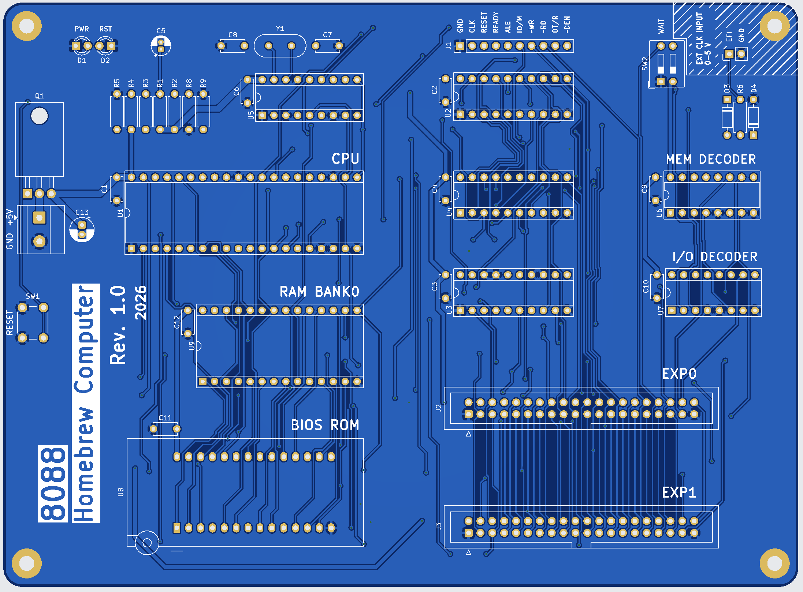
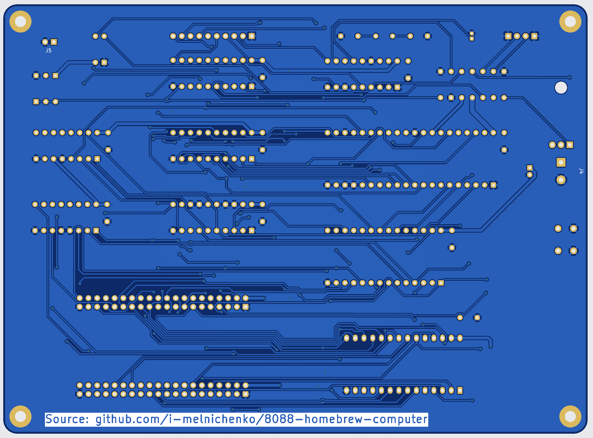

# 8088 Homebrew Computer

An open-source modular computer built around the Intel 8088 CPU.

## Overview

This project explores the design of a modular 8088-based computer using
through-hole DIP components and a custom expansion architecture.

The project is developed incrementally, starting with a minimal working
system and gradually adding new hardware and software capabilities.

## Mainboard Rev. 1.0

| Front | Back |
| --- | --- |
|  |  |

### Bill of materials

The table below is derived from
[`hardware/kicad/8088-mainboard`](hardware/kicad/8088-mainboard). All
components are through-hole.

| Designators | Qty. | Part / value | Footprint / notes |
| --- | ---: | --- | --- |
| U1 | 1 | Intel 8088, minimum mode | DIP-40, 15.24 mm socket footprint |
| U2, U3 | 2 | 74LS373 | DIP-20, 7.62 mm socket footprint |
| U4 | 1 | 74LS245 | DIP-20, 7.62 mm socket footprint |
| U5 | 1 | 8284 clock generator / driver | DIP-18, 7.62 mm socket footprint |
| U6, U7 | 2 | 74LS138 | DIP-16, 7.62 mm socket footprint |
| U8 | 1 | 28C256 EEPROM | DIP-28 socket footprint; 3M 228-1277-00-0602J |
| U9 | 1 | HM62256BLP SRAM | DIP-28, 15.24 mm socket footprint |
| Q1 | 1 | NDP6020P P-channel MOSFET | TO-220-3, horizontal tab-down |
| Y1 | 1 | 14.31818 MHz crystal | HC-49/U, vertical |
| R1, R2, R5, R8, R9 | 5 | 10 kΩ | DIN0207 axial, 7.62 mm pitch |
| R3 | 1 | 680 Ω | DIN0207 axial, 7.62 mm pitch |
| R4 | 1 | 2 kΩ | DIN0207 axial, 7.62 mm pitch |
| R6 | 1 | 1 kΩ | DIN0207 axial, 7.62 mm pitch |
| C1–C4, C6, C9–C12 | 9 | 100 nF ceramic | Disc capacitor, 5.00 mm pitch |
| C7, C8 | 2 | 33 pF ceramic | Disc capacitor, 5.00 mm pitch |
| C5 | 1 | 10 µF electrolytic | Radial, 1.50 mm pitch |
| C13 | 1 | 220 µF electrolytic | Radial, 2.00 mm pitch |
| D1 | 1 | Power LED | 3 mm THT LED |
| D2 | 1 | Reset LED | 3 mm THT LED |
| D3, D4 | 2 | BAT85 Schottky diode | DO-35 / SOD-27, 7.62 mm pitch |
| SW1 | 1 | Reset pushbutton | 6 mm THT tactile switch |
| SW2 | 1 | 2-position DIP switch | SPST ×2, 2.54 mm pitch |
| J1 | 1 | 10-pin connector | 1×10 pin header, 2.54 mm pitch |
| J2, J3 | 2 | Expansion connectors (Exp0, Exp1) | IDC header, 2×20, 2.54 mm pitch |
| J4 | 1 | 5 V power input | 2-pin Phoenix MKDS-1,5, 5.08 mm pitch |
| J5 | 1 | External clock input | 1×2 pin header, 2.54 mm pitch |

For ICs, sockets are recommended; the PCB footprints already provide for them.

## Links

- [DIY EEPROM Programmer](https://github.com/erikvanzijst/eeprom)
