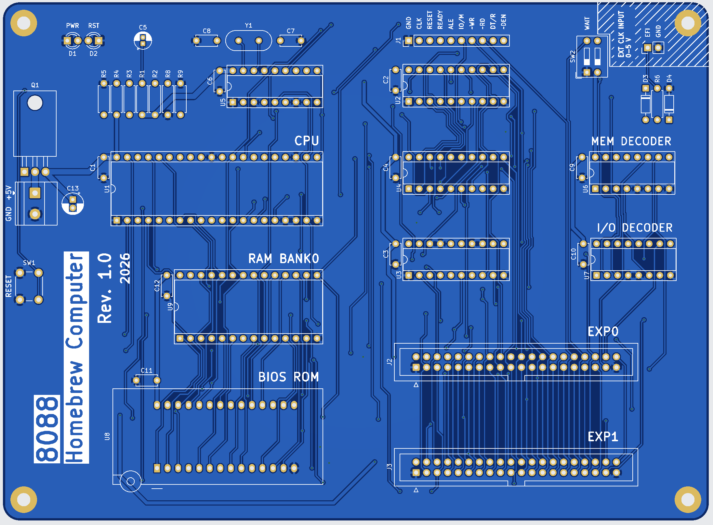
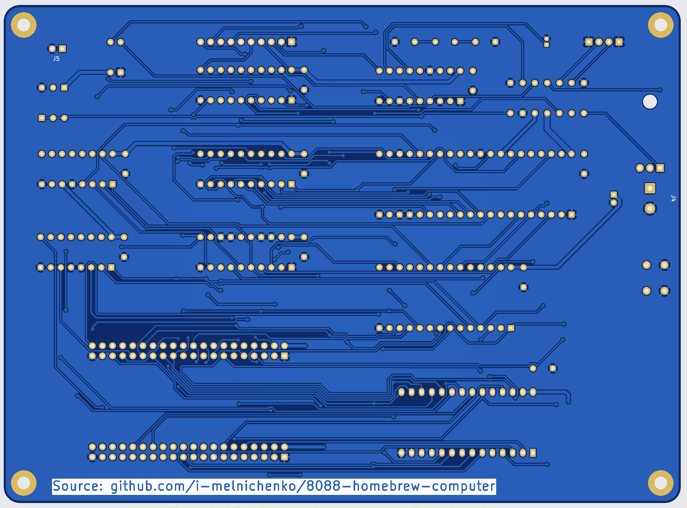

# 8088 Homebrew Computer

An open-source modular computer built around the Intel 8088 CPU.

## Overview

This project explores the design of a modular 8088-based computer using
through-hole DIP components and a custom expansion architecture.

The project is developed incrementally, starting with a minimal working
system and gradually adding new hardware and software capabilities.

## Firmware

The default firmware is a [minimal ROM BIOS](firmware/8088-mainboard/bios.asm).
It builds a 32 KiB EEPROM image, initializes an HD44780-compatible 20×4 LCD
on `Exp1`, copies the bundled program to SRAM, and transfers control to it.

## Mainboard Rev. 1.0

| Front | Back |
| --- | --- |
|  |  |

### Bill of materials

The table below is derived from [`hardware/kicad`](hardware/kicad). All
components are through-hole.

| Designators | Qty. | Part / value | Footprint / notes |
| --- | ---: | --- | --- |
| U1 | 1 | Intel 8088, minimum mode | DIP-40, 15.24 mm socket footprint |
| U2, U3 | 2 | 74LS373 | DIP-20, 7.62 mm socket footprint |
| U4 | 1 | 74LS245 | DIP-20, 7.62 mm socket footprint |
| U5 | 1 | 8284 clock generator / driver | DIP-18, 7.62 mm socket footprint |
| U6, U7 | 2 | 74LS138 | DIP-16, 7.62 mm socket footprint |
| U8 | 1 | 28C256 EEPROM | DIP-28 socket footprint; 3M 228-1277-00-0602J |
| U9 | 1 | HM62256BLP SRAM | DIP-28, 15.24 mm socket footprint |
| Q1 | 1 | NDP6020P P-channel MOSFET | TO-220-3, horizontal tab-down |
| Y1 | 1 | 14.31818 MHz crystal | HC-49/U, vertical |
| R1, R2, R5, R8, R9 | 5 | 10 kΩ | DIN0207 axial, 7.62 mm pitch |
| R3 | 1 | 680 Ω | DIN0207 axial, 7.62 mm pitch |
| R4 | 1 | 2 kΩ | DIN0207 axial, 7.62 mm pitch |
| R6 | 1 | 1 kΩ | DIN0207 axial, 7.62 mm pitch |
| C1–C4, C6, C9–C12 | 9 | 100 nF ceramic | Disc capacitor, 5.00 mm pitch |
| C5 | 1 | 10 µF electrolytic | Radial, 1.50 mm pitch |
| C13 | 1 | 220 µF electrolytic | Radial, 2.00 mm pitch |
| D1 | 1 | Power LED | 3 mm THT LED |
| D2 | 1 | Reset LED | 3 mm THT LED |
| D3, D4 | 2 | BAT85 Schottky diode | DO-35 / SOD-27, 7.62 mm pitch |
| SW1 | 1 | Reset pushbutton | 6 mm THT tactile switch |
| SW2 | 1 | 2-position DIP switch | SPST ×2, 2.54 mm pitch |
| J1 | 1 | 10-pin connector | 1×10 pin header, 2.54 mm pitch |
| J2, J3 | 2 | Expansion connectors (Exp0, Exp1) | IDC header, 2×20, 2.54 mm pitch |
| J4 | 1 | 5 V power input | 2-pin Phoenix MKDS-1,5, 5.08 mm pitch |
| J5 | 1 | External clock input | 1×2 pin header, 2.54 mm pitch |

> **Rev. 1.0 note:** Do not populate C7 or C8. These capacitors were removed
> from the Rev. 1.1 design.

For ICs, sockets are recommended; the PCB footprints already provide for them.

### Display module

The table below is derived from the
[`display-module` schematic](hardware/kicad/display-module/display-module.kicad_sch).

| Designators | Qty. | Part / value               | Footprint / notes |
| --- | ---: |----------------------------| --- |
| U1 | 1 | 74LS00                     | DIP-14, 7.62 mm socket footprint |
| U2 | 1 | 74LS373                    | DIP-20, 7.62 mm socket footprint |
| DS1 | 1 | WC1602A 16×2 LCD           | 1×16, 2.54 mm pin socket |
| C2, C3 | 2 | 100 nF ceramic             | Disc capacitor, 5.00 mm pitch |
| R2 | 1 | 650 Ω                      | DIN0207 axial, 7.62 mm pitch |
| RV1 | 1 | 10 kΩ potentiometer        | Runtron RM-065, vertical |
| J1 | 1 | Expansion connector (Exp1) | 2×20 pin socket, 2.54 mm pitch |

### UART module

The table below is derived from the
[`uart-module` schematic](hardware/kicad/uart-module/uart-module.kicad_sch).

| Designators | Qty. | Part / value | Footprint / notes              |
| --- | ---: | --- |--------------------------------|
| U1 | 1 | GM16C550 UART | DIP-40, 15.24 mm               |
| Y1 | 1 | 1.8432 MHz crystal | HC-49/U, vertical              |
| C1 | 1 | 22 pF ceramic | Disc capacitor, 5.00 mm pitch  |
| C2 | 1 | 47 pF ceramic | Disc capacitor, 5.00 mm pitch  |
| C3 | 1 | 100 nF ceramic | Disc capacitor, 5.00 mm pitch  |
| R3–R6 | 4 | 10 kΩ | DIN0207 axial, 7.62 mm pitch   |
| R1 | 1 | 1 MΩ | DIN0207 axial, 7.62 mm pitch   |
| R2 | 1 | 1.5 kΩ | DIN0207 axial, 7.62 mm pitch   |
| R7 | 1 | 1 kΩ | DIN0207 axial, 7.62 mm pitch   |
| R8 | 1 | 2 kΩ | DIN0207 axial, 7.62 mm pitch   |
| J1 | 1 | Expansion connector (Exp0) | 2×20 pin socket, 2.54 mm pitch |
| J2 | 1 | CP2102 module | 1×03 pin header, 2.54 mm pitch |

## Links

- [DIY EEPROM Programmer](https://github.com/erikvanzijst/eeprom)
