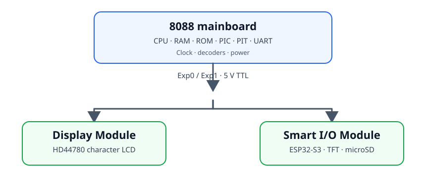

# 8088 Homebrew Computer

An open-source modular computer built around the Intel 8088 CPU, using
through-hole DIP components and a custom expansion architecture. Development
proceeds incrementally from a minimal working system toward additional hardware
and software capabilities.

## Mainboard Rev. 2.0

| Front | Left-side assembly view |
| --- | --- |
|  |  |

## Architecture

The mainboard is built around an Intel 8088 in minimum mode. It exposes a
20-bit address bus (`A0…A19`) and an 8-bit data bus (`D0…D7`); two 74LS373
latches demultiplex `AD0…AD7`, and a 74LS245 buffers the data bus.

## Memory map

| Address range | Function |
| --- | --- |
| `00000h–9FFFFh` | 640 KiB SRAM (five 128 KiB banks) |
| `A0000h–BFFFFh` | `EXP_MEM_CS5#` expansion-memory window, including the conventional `B8000h` video-memory area; available on both Exp0 and Exp1 |
| `C0000h–DFFFFh` | `EXP_MEM_CS6#` expansion-memory / option-ROM window; available on both Exp0 and Exp1 |
| `E0000h–FFFFFh` | 28C256 boot ROM (32 KiB mirrored in the window) |

## I/O map

| Device | Primary ports | Notes |
| --- | --- | --- |
| 8259A PIC | `20h`, `21h` | Interrupt controller |
| 8254 PIT | `40h–43h` | System timer |
| GM16C550 UART | `3F8h–3FFh` | COM1-compatible; mirrored because decoding is partial |
| `EXP_IO_CS4#` | `80h–9Fh` | Expansion I/O window; available on both Exp0 and Exp1 |
| `EXP_IO_CS5#` | `A0h–BFh` | Expansion I/O window; available on both Exp0 and Exp1 |
| `EXP_IO_CS6#` | `C0h–DFh` | Expansion I/O window; available on both Exp0 and Exp1 |

## UART console

The GM16C550 UART provides a COM1-compatible console at `3F8h–3FFh`. Its
1.8432 MHz crystal supports common serial rates; the intended console rate is
19,200 baud.

`J9` is a 3-pin TTL UART header (`GND`, `TXD`, `RXD`). To connect the computer
to a USB host, use an external **CP2102 USB-to-TTL adapter**: connect ground
and cross `TXD` with `RXD`. The CP2102 is powered by USB; do not connect its
power pin to the mainboard through `J9`. Verify that the selected CP2102 board
accepts the mainboard's 5 V TTL `TXD` level. This is not an RS-232 interface;
use a MAX232-compatible level converter before connecting an RS-232 port.

## Interrupts and timer

The 8259A PIC operates as a single 8086/8088-mode master and drives the
processor `INTR` input. The 8254 PIT provides the system tick: its channel 0
receives a 1.1931817 MHz clock from a 74LS74 divider and, when programmed with
a divisor of 65,536 in mode 3, produces an 18.2065 Hz interrupt on `IR0`.

| PIC input | PCB connection |
| --- | --- |
| `IR0` | `PIT_IRQ` from the 8254 system timer |
| `IR1` | `EXP_IRQ1` expansion line |
| `IR2` | `EXP_IRQ2` expansion line |
| `IR3` | `EXP_IRQ3` expansion line |
| `IR4` | `UART_IRQ` from the GM16C550 UART |
| `IR5` | `EXP_IRQ5` expansion line |
| `IR6` | `EXP_IRQ6` expansion line |
| `IR7` | `EXP_IRQ7` expansion line |

Each PIC request input has a 10 kΩ pull-down, keeping it inactive when no
device drives the line. Firmware must initialize the PIC and PIT before
enabling interrupts.

## Expansion modules

The mechanical and electrical contract for daughterboards is defined in the
[Expansion Module Standard Rev.2](docs/expansion-module-standard.md).

| Module | Purpose | Documentation |
| --- | --- | --- |
| Display Module | HD44780-compatible character LCD interface | [Configuration and BOM](docs/display-module.md) |
| Smart I/O Module | ESP32-based smart I/O, TFT, and SD interface | [Configuration and BOM](docs/smart-io-module.md) |

[//]: # (## Firmware)

[//]: # ()
[//]: # (The default firmware is a [minimal ROM BIOS]&#40;firmware/8088-mainboard/bios.asm&#41;.)

[//]: # (It builds a 32 KiB EEPROM image, initializes an HD44780-compatible 20×4 LCD)

[//]: # (on `Exp1`, copies the bundled program to SRAM, and transfers control to it.)

## Bill of materials

The table below is derived from [`hardware/kicad`](hardware/kicad) for Rev. 2.0.
It includes both through-hole and SMD components.

| Designators | Qty. | Part / value | Footprint / notes |
| --- | ---: | --- | --- |
| U1 | 1 | Intel 8088, minimum mode | DIP-40, 15.24 mm socket footprint |
| U2, U3 | 2 | 74LS373 | DIP-20, 7.62 mm socket footprint |
| U4 | 1 | 74LS245 | DIP-20, 7.62 mm socket footprint |
| U5 | 1 | 8284 clock generator / driver | DIP-18, 7.62 mm socket footprint |
| U6, U7 | 2 | 74LS138 | DIP-16, 7.62 mm socket footprint |
| U8 | 1 | 28C256 EEPROM | DIP-28 socket footprint; 3M 228-1277-00-0602J |
| U9–U13 | 5 | AS6C1008-55PCN SRAM | DIP-32, 15.24 mm socket footprint |
| U14 | 1 | GM16C550 UART | DIP-40, 15.24 mm socket footprint |
| U15 | 1 | 8259A-2 programmable interrupt controller | DIP-28, 15.24 mm socket footprint |
| U16 | 1 | 8254 programmable interval timer | DIP-24, 15.24 mm socket footprint |
| U17 | 1 | 74LS74 | DIP-14, 7.62 mm socket footprint |
| Q1 | 1 | NDP6020P P-channel MOSFET | TO-220-3, horizontal tab-down |
| Y1 | 1 | 14.31818 MHz crystal | HC-49/U, vertical |
| Y2 | 1 | 1.8432 MHz crystal | HC-49/U, vertical |
| R1–R3, R5–R7, R9–R10, R12, R15–R18, R21–R28 | 21 | 10 kΩ | 0805 SMD |
| R8, R19 | 2 | 1 kΩ | 0805 SMD |
| R11, R20 | 2 | 2 kΩ | 0805 SMD |
| R4 | 1 | 680 Ω | 0805 SMD |
| R13 | 1 | 1 MΩ | 0805 SMD |
| R14 | 1 | 1.5 kΩ | 0805 SMD |
| R29–R44 | 16 | 33 Ω | 0805 SMD; series isolation of the `D0…D7` branches for Exp0 and Exp1 |
| C1–C4, C6–C14, C18–C21 | 17 | 100 nF ceramic | 0805 SMD |
| C5 | 1 | 10 µF electrolytic | Radial, 1.50 mm pitch |
| C15 | 1 | 220 µF electrolytic | Radial, 2.00 mm pitch |
| C16 | 1 | 22 pF ceramic | 0805 SMD |
| C17 | 1 | 47 pF ceramic | 0805 SMD |
| D1 | 1 | Reset LED | 0805 SMD |
| D2 | 1 | Power LED | 0805 SMD |
| SW1 | 1 | 3-position DIP switch | SPST ×3, 2.54 mm pitch |
| SW2 | 1 | Reset pushbutton | 6 mm THT tactile switch |
| J1 | 1 | 10-pin connector | 1×10 pin header, 2.54 mm pitch |
| J2 | 1 | External reset connector | 1×2 pin header, 2.54 mm pitch |
| J3 | 1 | External clock connector | 1×2 pin header, 2.54 mm pitch |
| J4, J6 | 2 | Expansion connectors (Exp0-A, Exp1-A) | 2×20 pin socket, 2.54 mm pitch |
| J5, J7 | 2 | Expansion connectors (Exp0-B, Exp1-B) | 2×10 pin socket, 2.54 mm pitch |
| J8 | 1 | 5 V power input | 2-pin Phoenix MKDS-1,5, 5.08 mm pitch |
| J9 | 1 | CP2102 module connector | 1×3 pin header, 2.54 mm pitch |
| J10, J11 | 2 | 4-pin auxiliary connectors | 1×4 pin header, 2.54 mm pitch |

For ICs, sockets are recommended; the PCB footprints already provide for them.

## Links

- [DIY EEPROM Programmer](https://github.com/erikvanzijst/eeprom)
